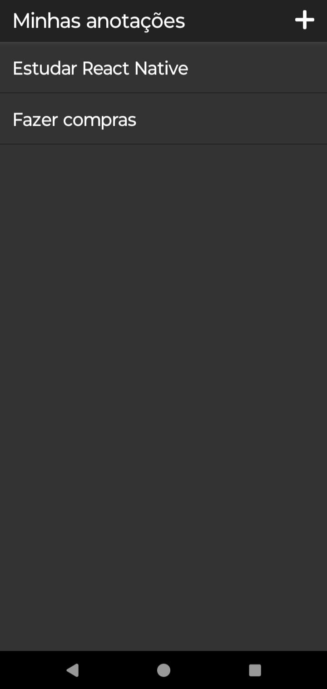
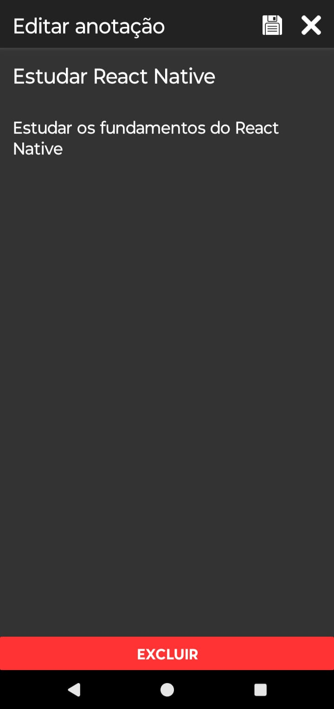

<!-- CABEÇALHO -->

    <h1>
        Devs Notes
    </h1>
    

        <a href="#%EF%B8%8F-sobre-o-projeto">Sobre o Projeto</a> •
        <a href="#-funcionalidades">Funcionalidades</a> •
        <a href="#-layout">Layout</a> •
        <a href="#%EF%B8%8F-tecnologias">Tecnologias</a> •
        <a href="#-autor">Autor</a>
    

<!-- SOBRE O PROJETO -->

## 🖥️ Sobre o Projeto

> Projeto desenvolvido para o curso de React Native da **[B7Web](https://lp.b7web.com.br/curso?utm_source=g_search&gad_source=1&gclid=Cj0KCQjw0ruyBhDuARIsANSZ3wp9UBWv_fT3Z3RSDaMmC6kP6A-mB_fALA3VPSxT4znFBBWaYkzxJzgaAtVvEALw_wcB)**.

Esse projeto consiste em uma aplicação de gerenciamento de anotações.

<!-- FUNCIONALIDADES -->

## 💡 Funcionalidades

- [x] Listar anotações
- [x] Exibir detalhes de uma anotação
- [x] Criar uma anotação
- [x] Editar informações de uma anotação
- [x] Excluir uma anotação

<!-- LAYOUT -->

## 🎨 Layout

  
  

<!-- TECNOLOGIAS -->

## 🛠️ Tecnologias

Para o desenvolvimento desse projeto, as seguintes ferramentas foram utilizadas:

- **[React Native](https://reactnative.dev/)**
- **[JavaScript](https://developer.mozilla.org/pt-BR/docs/Web/JavaScript/)**
- **[React Navigation](https://reactnavigation.org/)**
- **[Expo](https://expo.dev/)**
- **[Styled Components](https://www.styled-components.com/)**
- **[Redux](https://redux.js.org/)**

## 👨‍💻 Autor

Marcos Kenji Kuribayashi

 

---

Desenvolvido por Marcos Kenji Kuribayashi 😉
